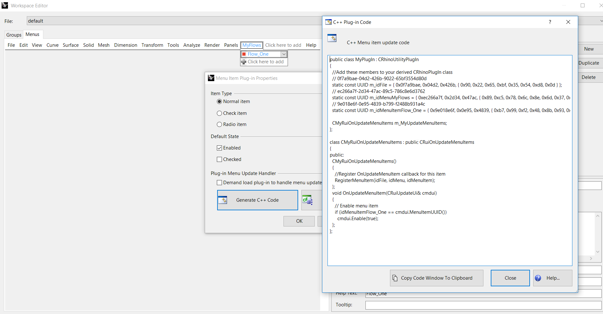

# Design Steps for Flow Based Plugins
- [Design Steps for Flow Based Plugins](#design-steps-for-flow-based-plugins)
  - [Creating Workspace and Toolbars in Rhino](#creating-workspace-and-toolbars-in-rhino)
  - [Creating C++ SampleFlow Rhino Plugin](#creating-c-sampleflow-rhino-plugin)
  - [Create Menu and Menu-items in Flows.rui](#create-menu-and-menu-items-in-flowsrui)
  - [Connect a menu item to a toolbar](#connect-a-menu-item-to-a-toolbar)
  - [Show / Hide Toolbar](#show--hide-toolbar)
  - [How to deploy a toolbar with a plugin](#how-to-deploy-a-toolbar-with-a-plugin)
  - [Programmatically connect Start Flow to plugin](#programmatically-connect-start-flow-to-plugin)


## Creating Workspace and Toolbars in Rhino

In this section we describe how to create a Workspace and Toolbars using Rhino 6.

1. Create a separate workspace called `Flows` from `Tools > Options > Toolbars`
   

2. Next step is to add a new toolbar called `Sample Flow` as shown below
  
**Note: Our goal is to connect the `Sample Flow` toolbar with a plugin of the same name.**

3. Then we add several buttons to the `Sample Flow` toolbar. Here each button represents a particular step in the flow. 
  
[How to create macros for toolbars](https://docs.mcneel.com/rhino/6/help/en-us/index.htm#toolbarsandmenus/macro_library.htm?Highlight=macro%20menu%20text)
**Note: Our goal is to connect each step in the `Sample Flow` toolbar with a command in the plugin with the same name.**

## Creating C++ SampleFlow Rhino Plugin

1. Open up the Flows folder in Visual Studio 2017.

2. Create new project in Visual Studio 2017  `File > New > Project`

<!-- 3. Assuming the Rhino 6 SDK is installed create a Visual C++ project for the `SampleFlow` Rhino Plugin. Note that the boiler plate project code generated by Rhino 6 SDK can be found in : `Flows/SampleFlow/SampleFlow`. We move the contents of Flows/SampleFlow directory to `Flows/` directory to avoid repetetive naming of directories. -->

3. Now open the `SampleFlow.sln` file from `Flows/` folder and rename the solution to `Flows`

4. Now go to the auto generated Flow_One Visual C++ project and in the `stdafx.h` file uncomment line 19 `#define RHINO_SDK_MFC`. We need to uncomment this line as we would be using the MFC UI functionality. **_Note: Rhino 6 is almost MFC free except for the RhinoUI library which requires MFC as the Rhino Application is based on MFC_**

5. Then go to file `SampleFlowPlugIn.cpp` and comment the line 46 so that the plugin compiles. Note that in general delete this line after filling in the appropriate information asked for.

6. In Visual Studio 2017 go to `Project > Properties` and then in `C/C++ > Language` change the `C++ Language Standard` to `ISO C++14Standard (/std:c++14)` and apply
  
Followed by build should compile the `SampleFlow` Rhino plugin project successfully.

## Create Menu and Menu-items in Flows.rui

1. In the next step we go to the `Flows.rui` workspace and open the `Workspace Editor` and go to the `Menus` where we add the Menu and Menu-Item.

2. To connect the menu item `Sample Flow` to the plugin we use the `Workspace Editor` in Rhino to create the corresponding C++ code.
  

3. Then we transfer the code to the Flow_One plugin project into the following files :`FlowsRuiOnUpdateMenuItems.h, FlowsRuiOnUpdateMenuItems.cpp`

```cpp
#include "stdafx.h"
#include "FlowsRuiOnUpdateMenuItems.h"
#include "SampleFlowPlugIn.h"

CFlowsRuiOnUpdateMenuItems::CFlowsRuiOnUpdateMenuItems()
{
    // Register OnUpdateMenuItem callback for this item
    RegisterMenuItem(CSampleFlowPlugIn::m_idFile, CSampleFlowPlugIn::m_idMenuFlows, CSampleFlowPlugIn::m_idMenuItemSampleFlow);
}

void CFlowsRuiOnUpdateMenuItems::OnUpdateMenuItem(CRuiUpdateUi& cmdui)
{
    // Enable menu item
    if (CSampleFlowPlugIn::m_idMenuItemSampleFlow == cmdui.MenuItemUUID())
    {
        cmdui.Enable(true);
    }
}

```

and the following `static const` variables are added to `SampleFlowPlugIn.cpp`

```cpp
const UUID CSampleFlowPlugIn::m_idFile = { 0x6fbd18ca, 0xbdce, 0x44ae, { 0xba, 0x8f, 0x3c, 0x2c, 0x46, 0x3e, 0x52, 0xf9 } };
const UUID CSampleFlowPlugIn::m_idMenuFlows = { 0x130a9a5b, 0x5620, 0x4588, { 0x96, 0x41, 0x13, 0xd6, 0x7d, 0x4a, 0x19, 0x07 } };
const UUID CSampleFlowPlugIn::m_idMenuItemSampleFlow = { 0x7648b550, 0xb008, 0x42ab, { 0xb2, 0xb3, 0xf1, 0xb8, 0xf4, 0xac, 0xe5, 0x97 } };
```

## Connect a menu item to a toolbar

Now we would like to connect the Menu-item `Sample Flow` with the corresponding `Sample Flow` toolbar.

1. First we open the `Workspace Editor` for the `Flows.rui`and then goto `Menus`.
2. Click on `Flows > Sample Flow > Item Properties`
  

3. After this in the `Command` section of `Item Properties` for `Sample Flow` call the correct commands such that the Toolbar pops up.
    

## Show / Hide Toolbar

TODO

## How to deploy a toolbar with a plugin

The next step would be to connect the `Simple Flow` toolbar with the plugin with the same name.
[Create and Deploy Toolbars](https://developer.rhino3d.com/guides/rhinocommon/create-deploy-plugin-toolbar/)

## Programmatically connect Start Flow to plugin

In this section we will describe the steps to programmatically connect `Start Flow` button in the `Sample Flow` Toolbar to the `Sample Flow` plugin in Rhino. The design is based on the [Command pattern](https://en.wikipedia.org/wiki/Command_pattern).

1. For the `Start Flow` button we create a corresponding command `cmdStartFlow.cpp` in the `Flows.sln`.

2. For the `Start Flow` button we create a new Viewport for our `Sample Flow` plugin. This is done by using the Command Pattern and creating a separate class called `CSampleFlowViewReceiver` such that from the class `CCommandStartFlow` we invoke the `action` method on a `CSampleFlowViewReceiver` object.

3. The next step then is to connect the `Start Flow` command in the `Sample Flow` plugin to the `Start Flow` button
   
   
