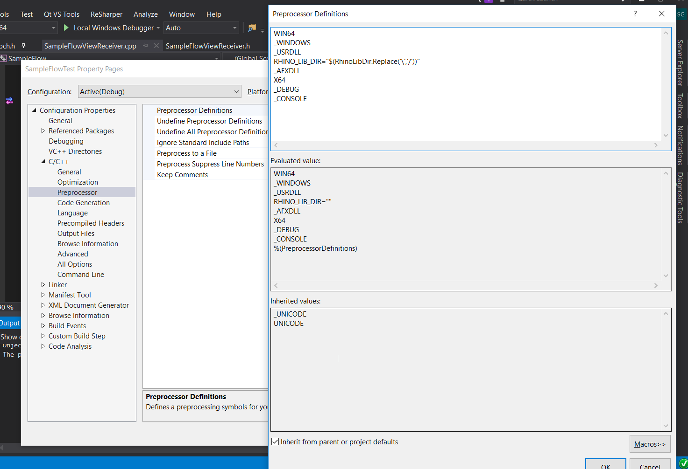
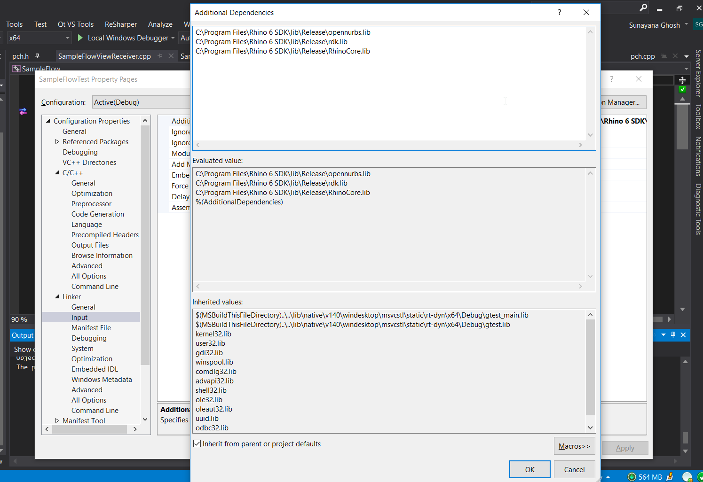

# TDD with Rhino 6 C++ SDK and Google Test

In this document we describe how to setup test for Rhino 6 plugins using Google Test. The tests are created as a separate project and not as Rhino 6 plugin project with the advantage that the Rhino application is not started while testing which makes for streamlined testing environment.

- [TDD with Rhino 6 C++ SDK and Google Test](#tdd-with-rhino-6-c-sdk-and-google-test)
    - [Create SampleFlowTest project](#create-sampleflowtest-project)

## Create SampleFlowTest project

1. From the Flows solution in Visual Studio 2017 go to `Add > New Project`. From `Visual C++ > Test` choose `Google Test` and create the project with the name `SampleFlowsTest`.

2. While creating the project add `SampleFlow` as one of the references to the test project.

3. Then go to the Project Properties for `SampleFlowTest` project and make sure the following property variables are set.
   - In `Project Properties > Configuration Properties > General`, `Project Defaults > Configuration Type > Application(exe)`.
   - In `Project Properties > Configuration Properties > VC++ Directories` add the path `C:\Program Files\Rhino 6 SDK\inc` in `Include Directories` and `C:\Program Files\Rhino 6 SDK\lib\Release` in `Library Directories`.
   - In `Project Properties > Configuration Properties > C/C++ > Preprocessor` add the following to the `Preprocessor Definitions` 
   - In `Project Properties > Configuration Properties > C/C++ > Language` set `C++ Language Standard : ISO C++ 14 Standard(/std:c++14)`.
   - In `Project Properties > Configuration Properties > Linker > Input` add the following additional dependencies: 
  
4. Then we add the [targetver.h](../SampleFlowTest/targetver.h) and add necessary changes to [pch.h](../SampleFlowTest/pch.h) so as to make the test project Rhino 6 ready.

The `SampleFlowTest` project should now compile successfully.